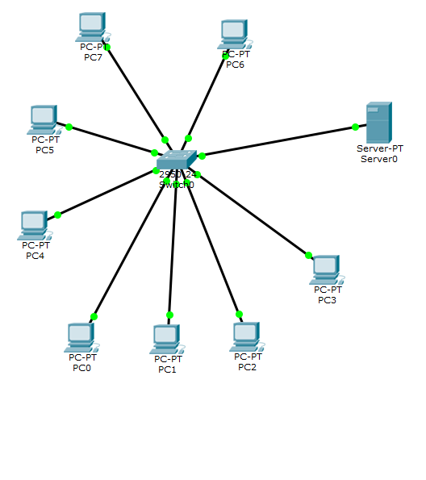

# 🖥️ Foundation Lab: 8-Node Local Area Network

This repository contains my introductory **Cisco Packet Tracer** project. It demonstrates the ability to design and scale a basic network by connecting multiple end-devices to a single central switch and managing a manual IP addressing scheme.

## 🏗️ Network Topology
The lab utilizes a **Star Topology** consisting of:
* **End Devices:** 8 Desktop Workstations.
* **Intermediary Device:** 1 Cisco 2960-24TT Layer 2 Switch.
* **Cabling:** Copper Straight-Through Ethernet cables.

## 🛠️ Technical Implementation
1.  **Physical Scaling:** Established physical links for 8 separate nodes to a 24-port switch, ensuring all ports achieved a "Forwarding" (Green) state.
2.  **Addressing:** Assigned unique **Static IPv4 addresses** to all 8 PCs within the same subnet (broadcast domain).
3.  **Verification:** Conducted end-to-end connectivity tests using the `ping` command. Verified 0% packet loss across all devices, confirming a functional local network.

## 🧠 Key Concepts Learned
* **Star Topology Advantages:** Understanding how a central switch allows the network to stay online even if one workstation's cable fails.
* **Port Management:** Utilizing a high-density switch (24 ports) to allow for future office expansion.
* **Layer 2 Fundamentals:** How a switch facilitates data exchange between multiple hosts without collisions.

---
*This 8-PC setup was the first step in my journey toward building the more complex VPN and Wireless systems found in my other repositories.*
